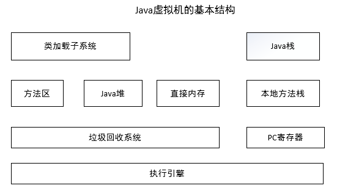
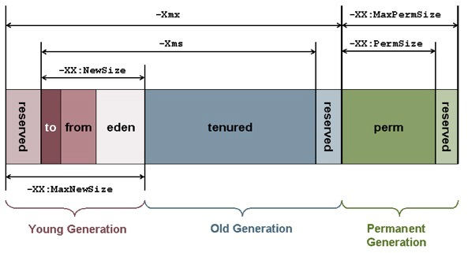
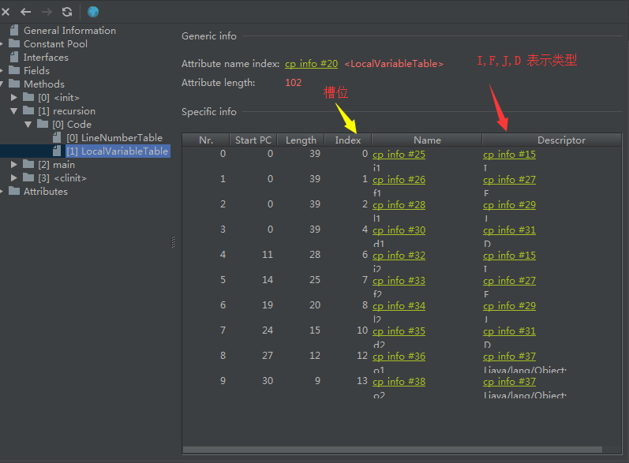
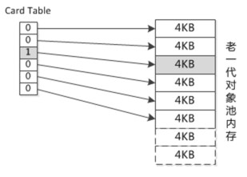
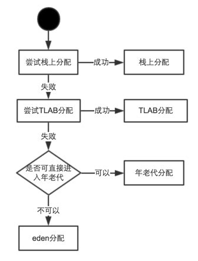
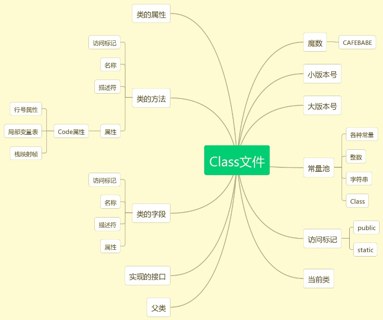
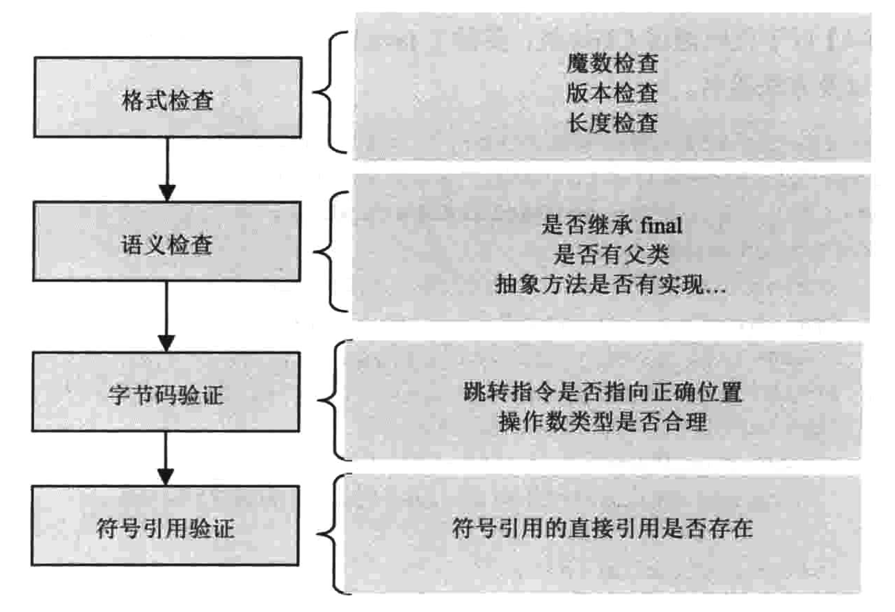

# 实战JAVA虚拟机

# java语言规范

语法，词法，支持的数据类型，变量类型，数据类型转换的约定，数组，异常等，告诉开发人员“java代码应该怎么样写”

## 词法

什么样的单词是对的。

|整数可以有下划线

## 语法

什么样的语句是对的。

## 数据类型的定义

char为16位无符号整数。
float和double为满足IEEE754的32位浮点数和64位浮点数。

引用数据类型分为3重
* 类/接口
* 泛型类型
* 数组类型

## 数字编码

整数用补码表示，正数的补码是本身，负数的补码就是反码+1。反码就是符号位不变，其他位取反。

### 补码的好处
* 0既不是正数也不是负数，反码不好表示，补码则相同。
* 补码将加减法的做法完全统一，无需区分正数和负数

### 浮点数的表示

IEEE754规范，一个浮点数由符号位，指数位和尾数位3部分组成。
32位的float类型，符号位1位，指数位8位，尾数位为23位。

| s eeeeeeee m(23个）
| 当e全部为0的时候，m前面加0，否则加1


浮点数取值为 s * m * 2的（e-127）次方

-5 = 1 1000001 010（21个0）

因为 e 不全为0，前面加个1，实际尾数为 1010（21个0）

```
-5 = -1 * 2的（129-127）次方 * （1*2的0次方+0*2的-1次方+1*2的-2次方+0*2的-3次方+后面都是0）
    = -1 * 4 * （1 + 0 + 1/4 + 0 ...）
    = -1 * 4 * 1.25
    = -5
```

```java
        float f = -5;

        // float的内部表示
        System.out.println(Integer.toBinaryString(Float.floatToRawIntBits(f)));
//1  10000001(指数位8位)  01000000000000000000000（23位）
	

        double d = -5;

//1 10000000001（指数位11位） 0100000000000000000000000000000000000000000000000000（52位）
        // double 的内部表示
        System.out.println(Long.toBinaryString(Double.doubleToRawLongBits(d)));
```

# 基本结构



NIO可以使用直接内存（堆外内存）。

PC：如果是不是本地方法，PC指向正在执行的指令，如果是本地方法，PC就是undefined。

## 堆




## 栈

| -Xss128K 指定最大栈空间。

线程私有的内存空间。

至少包含：
* 局部变量表
* 操作数栈
* 帧数据区

函数被返回的时候，栈帧被弹出。二种方式
* 正常返回，就是return
* 异常抛出

栈深度太大，会抛出 **StackOverflowError** 栈溢出错误。


### 局部变量表

保持函数的参数和局部变量。越多越大，嵌套调用次数就会减少。

```java
    public static  void recursion(int i1, float f1, long l1, double d1){
        count++;

        // 局部变量
        int i2=1; // 1 word = 32bit
        float f2 = 2f; // 1 word
        long l2 = 3L; // 2 word
        double d2 = 4; // 2 word

        Object o1= null; // 1 word
        Object o2= null; // 1 word

        recursion(i1,f1,l1, d1);
    }
```




**槽位复用**

```java
    // 复用槽位
    public static  void recursion2(int i1){
        {
            int i2 = i1;
            System.out.println(i2); // 需要使用，否则优化掉了
        }

        int i3 = 1;
    }
```


**占2word的槽位的复用**

```java
    // 局部变量表是4 word
    public static  void recursion3(double d1){
        {
            double d2 = d1; // 2 word
            System.out.println(d2);
        }

        int i3 = 1; // 1 word 复用 d2的第一个1槽位
        int i4 = 2; // 1 word 复用 d2的第二个操作
    }

```

**槽位和gc**

```java
    public static  void gc(){
        {
            byte[] a = new byte[6*1024*1024];
        }

        // a 虽然失效，但仍然在局部变量表，无法gc
        System.gc();
    }

    public static  void gc2(){
        {
            byte[] a = new byte[6*1024*1024];
        }

        int c = 1;

        // a 虽然失效，但仍然在局部变量表，无法gc
        System.gc();
    }
```

### 异常处理表

异常处理表是帧数据区重要的一部分

```java
    public static void main(String[] args) {
        try {
            recursion(1,2,3,4);
        }
        catch (Throwable e){
            System.out.println(count);
            e.printStackTrace();
        }
    }
```

**机器码如下**


**异常表如下**


## 栈上分配

基础的基于 **逃逸分析** （判断对象的作用域是否可能逃逸出函数体）

必须 **server模式** 。栈上分配并没有真正实现，是通过标量替换实现的。？

| -server -XX:+DoEscapeAnalysis -XX:+EliminateAllocations


**逃逸分析**
* 同步消除
* 标量替换

通过-XX:+**EliminateAllocations** 可以开启标量替换， -XX:+**PrintEliminateAllocations** 查看标量替换情况。

## 方法区

1.8之前可以理解为 **永久区**（PerSize，MaxPerSize）。1.8之后使用 **元数据区** 取代。（MaxMetaspaceSize）。


---
---
---


# 常用java虚拟机参数

## 参看参数

-XX:+PrintFlagsInitial 打印所有参数

-XX:+PrintFlagsFinal

-XX:+PrintCommmandLineFlags 打印传递的参数

-XX:+PrintVMOptions

## GC信息

PrintGC/PrintGCDetails

PrintHeapAtGC(GC前后堆信息)

-Xloggc:log/gc.log 日志存放


## 类加载、卸载

-verbose:class 跟踪类加载和卸载。等于 -XX:+TraceClassLoding 和  -XX:+TraceClassUnLoding

> verbose - 
adj.冗长的；啰嗦的；唠叨的。详细；罗嗦的；详细的


## 非堆内存

-XX:MaxDirectMemorySize，如果不配置，默认为最大堆空间（-Xmx）。直接内存使用达到时候会触发GC，可能导致OOM

## 虚拟机工作模式

Client / Server /


---
---
---
# GC算法

## 引用计数器

存在循环引用和性能问题。没有采用。

## 标记清除法

标记阶段：通过根节点，标记所有可到达对象

**缺点** 回收后的空间是不连续的。

## 复制算法（新生代）

内存分2块，每次用一块。

**新生代**：分为eden，from，to 3块。from和to称为survivor区，大小一样的2块。

**老生代**

这种算法适合 **新生代** 。

## 标记压缩法（老生代）

将所有存活对象压缩到内存一端，然后直接清除边界外的空间。

## 分代算法

新生代采用复制算法，老生代采用标记压缩法/标记清除算法。

### 卡表（Card Table）

卡表中每一个位表示年老代4K的空间，卡表记录未0的年老代区域没有任何对象指向新生代，只有卡表位为1的区域才有对象包含新生代引用，因此在新生代GC时，只需要扫描卡表位为1所在的年老代空间。使用这种方式，可以大大加快新生代的回收速度。



卡表为1的时候，才扫描对应的老生代。

新生代GC的时候，只需要扫描所有卡表为1所在的老生代空间。加快新生代GC时间。


## 分区算法

内存分为多个区处理。


## 可触及性

包含3种状态

* 可触及的：根节点开始可到达。
* 可复活的：对象所有引用被释放，但是对象可能在finalize函数中复活。
* 不可触及的：finalize函数已经调用，而且没有复活。

## 引用

* 强引用
* 软引用：可被回收。GC 不一定会回收，但内存紧张就会被回收，不会导致OOM。
* 弱引用：发现就回收，不够空间够不够。
* 虚引用：对象回收跟踪，必须和引用队列一起使用，作业在于跟踪垃圾回收过程。

## STW（Stop-The-World）


---
---
---
# 垃圾收集器和内存分配

## 串行回收器

-XX:+UseSerialGC，老生代和新生代都使用。

## 并行回收器

### 新生代 ParallelGC 回收器

复制算法

### 老生代 ParallelOldGC 回收器

关注吞吐量。

## CMS回收器

标记清除算法。


* 初始标记：STW，标记根对象
* 并发标记：标记所有对象
* 预清理：清理前准备以及控制停顿时间
* 重新标记：STW，修正并发标记数据
* 并发清理
* 并发重制

除了那2个STW(图片中全红的)，其他时候可以和应用线程并发执行。

## G1回收器(Garbage First)

jdk1.7的并行的分代垃圾回收器，依然区分年轻代和老生代，依然有eden区和servivor区。

没有采用传统物理隔离的新生代和老年代的布局方式，仅仅以逻辑上划分为新生代和老年代，选择的将 Java 堆区划分为 2048 个大小相同的独立 Region 块。


### 对象进入老生代

* 多次gc存活
* 大对象直接进入
  * 超过from/to大小
  * 超过 **PertenureSizeThredhold** 参数大小

### TLAB上分配对象

Thread Local Allocation Buffer，线程本地分配缓存。

为了加速对象分配。由于对象一般在堆上，而堆是共享的，需要同步。

占用eden区空间，在TLAB启用情况下，虚拟机会为每一个线程分配一块TLAB空间。默认很小（2048）。

-XX:+UserTLAB / -XX:PrintTLAB

-XX:TLABSize=102400 指定大小

-XX:-ResizeTLAB 大小会一直调整，可以禁止调整，一次性设置值。



### finalize()方法对垃圾回收的影响

函数finalize是由FinalizerThread线程处理的。每一个即将回收并且包含finalize方法的对象都会在正式回收前加入FinalizerThread的执行队列。

糟糕的Finalize方法（如耗时sleep 1秒），会导致对象来不及回收，导致OOM。

**MAT** 工具可以查看 Finalizers 


---
---
---
# 性能监控工具

## Linux下工具

* top：显示系统整体资源使用情况
* vmstat：监控内存和CPU
  * vmstat 1 3   每秒一次，一共3次
* iostat：监控IO使用
  * iostat 1 3
* pidstat：多功能诊断器（sysstat组件之一）
  * 需要安装 sudo apt-get install sysstat   

## windows下工具

* perfmon windows自带的性能监控器
* pslist 需要安装
* JDK性能监控工具
  * jps 
    * jps -mlv 
  * jstat 查看堆、GC情况
  * jinfo 查看和修改jvm参数（只是某些jvm参数）
  * jmap 生成堆，实例统计信息，classloader信息，Finalizer队列
    *  jmap -histo  <pid>
    *  jmap -dump:format=b,file=c:\heap.hprof <pid>
  * jhat 堆分析，分析jmap的dump文件，自动开启http服务网页查看
    * 支持OOL查询语句
  * jstack 线程堆栈分析（线程状态，死锁等）
  * jstatd 远程主机信息收集（RMI服务端程序）
  * jcmd 基本上就是上面命令的合计
    * jcmd 6356 列出可以执行的命令
    * jcmd 6356 GC.run 执行gc
    * jcmd 6356 GC.run
    * jcmd 6356 GC.class_histogram
  * hprof 性能统计工具
  
## jconsole 图形化工具

## visual vm

## bttrace

不停机情况下插入字节码。可以在 **visual vm** 的 **插件** 里面使用。


---
---
---
# 分析 java 堆


## OOM类型

* Java Heap 溢出（Java heap spacess）
* 虚拟机栈和本地方法栈溢出（StackOverflowError）
* 运行时永久区溢出（PermGen space），如常量池等
* 方法区溢出 （PermGen space）
* 线程过多（unable to creat new native thread）
* GC效率低下 (GC overhead limit exceeded)
* 直接内存内存溢出 (Direct buffer memory)
* 数组过大 （Requested array size exceeds VM limit）>=Integer.MAX_VALUE-1时

## string 虚拟机中实现

* 不变性
* intern

jdk6存在内存泄漏，string的长度和value无关。jdk7已解决。

### string常量池

jdk6之前，属于永久区。jdk7后，移到了堆中。

```java
    public static void main(String[] args) {
        List<String> list = new ArrayList<String>();

        int i = 0;

        while(true){
            list.add(("dd".repeat(1000)+String.valueOf(i++)).intern());
        }
    }
```

* jdk6报: OOM：permgen space
* JDK7后报：java.lang.OutOfMemoryError: Java heap space


---
---
---
# 锁和并发

## 对象头和锁


> biased - adj.偏向；偏重；有偏见的；倾向性的

锁对象头上会记录获取锁的线程，和锁的姿态。


## 完整过程

**锁的转换**


**重量级锁**


## 偏向锁

jdk1.6

> +XX:+UseBiasedLocking 启用偏向锁
> +XX:BiasedLockingStartupDelay=0 虚拟机默认4秒后启动偏向锁，可以通过设置马上启动。

锁被某个线程获取之后，进入了偏向锁模式。线程再次请求的时候，无需再次进行同步，节省时间。如果有其他线程请求锁，则退出偏向锁模式。

> 竞争激励的场景，偏向锁反而会因为频繁切换影响性能，可以使用jvm参数关掉。

## 轻量级锁

如果偏向锁**失败**，虚拟机会让线程申请轻量级锁。虚拟机内部，使用 **BasicObjectLock** 的对象实现。这个对象有一个**BasicLock对象**和一个**持有该锁的Java对象指针**组成。BasicObjectLock对象放置在java栈的**栈帧**中。BaseLock对象内部还维护着 **displaced_header** 字段，用于备份对象头部的**Mark Word**。


## 锁膨胀

如果轻量级锁失败，就会膨胀成重量级锁。

## 自旋锁


## 锁消除

不存在逸出的地方，编译的时候会自动去掉锁。

> -XX:+DoEscapeAnalysis -XX:+EliminateLocks

## 锁优化

* 减少锁持有时间
* 锁粗化 （大量切换请求还不如粗化）
* 减小锁粒度
* 锁分离
  * **LinkedBlockingQueue** ， 有 putLock 和 takeLock 2把 ReentrantLock 锁。

LinkedBlockingQueue 代码片段：

```java
    /** Lock held by take, poll, etc */
    private final ReentrantLock takeLock = new ReentrantLock();

    /** Wait queue for waiting takes */
    private final Condition notEmpty = takeLock.newCondition();

    /** Lock held by put, offer, etc */
    private final ReentrantLock putLock = new ReentrantLock();

    /** Wait queue for waiting puts */
    private final Condition notFull = putLock.newCondition();
```

## 无锁

### CAS （Compare And Swap）

### LongAdder（jdk8）

实质是想通过多个原子锁，来替代单一锁，减少多线程对单一锁的竞争，提高并发写的能力。distributed-cache-line-counter-scalable、LongAddr、ConcurrentHashMap都是这种思想。 

LongAdder适合的场景是 **统计求和计数的场景**，而且LongAdder基本只提供了add方法，而AtomicLong还具有cas方法。

## 将随机变为可控：理解java内存模型

### 原子性

64位的long类型读写并非原子操作。需要定义为 **volatie** 即可解决。

## 有序性

三种地方可能会导致指令重排：

* 编译器优化的重排序
* 指令级并行的重排序（指令级并行技术（Instruction-Level
Parallelism， ILP）来将多条指令重叠执行）
* 内存系统的重排序（处理器使用缓存和读/写缓冲区）

关键字：

* as-if-serial语义： 不管怎么重排序（编译器和处理器为了提高并行度），
（单线程）程序的执行结果不能被改变
* happens- before程序顺序规则


## 可见性

---
---
---
# Class 文件结构





Class文件格式

Class文件格式ClassFile结构体的C语言描述如下：

```C
struct ClassFile
{
    u4 magic;                    // 识别Class文件格式，具体值为0xCAFEBABE，
    u2 minor_version;            // Class文件格式副版本号，
    u2 major_version;            // Class文件格式主版本号，
    u2 constant_pool_count;      // 常数表项个数，
    cp_info **constant_pool;     // 常数表，又称变长符号表，
    u2 access_flags;             // Class的声明中使用的修饰符掩码，
    u2 this_class;               // 常数表索引，索引内保存类名或接口名，
    u2 super_class;              // 常数表索引，索引内保存父类名，
    u2 interfaces_count;         // 超接口个数，
    u2 *interfaces;              // 常数表索引，各超接口名称，
    u2 fields_count;             // 类的域个数，
    field_info **fields;         // 域数据，包括属性名称索引，域修饰符掩码等，
    u2 methods_count;            // 方法个数，
    method_info **methods;       // 方法数据，包括方法名称索引，方法修饰符掩码等，
    u2 attributes_count;         // 类附加属性个数，
    attribute_info **attributes; // 类附加属性数据，包括源文件名等。
};
```
 

其中 u2 为 unsigned short，u4 为 unsigned long：

```c
typedef unsigned char   u1;
typedef unsigned short  u2;
typedef unsigned long   u4;
```
 

cp_info **constant_pool 是常量表的指针数组，指针数组个数为 constant_pool_count，结构体cp_info为

>注意：各种常量结构不同

```c
// 类
struct constant_class_info
{
    u1 tag;            // 常数表数据类型
    u2 name_index;     // 常数池中索引
};

// utf8字符串
struct constant_utf8_info
{
    u1 tag;            // 常数表数据类型
    u2 length;         // 长度
    u1 bytes[length];  // 数据
};
```


## 重点看看方法结构


### line-number-table


### exception-table


## 强大的动态调用 - BootstrapMethods属性

lambda表达式的实现


---
---
---
# Class 装载系统

## 装载流程


### 类装载条件

>参考: [Java 类主动引用和被动引用](https://blog.csdn.net/qq_33314107/article/details/79109524)

必须使用的时候才装载。使用分主动和被动。

**主动**：

* 遇到new、getstatic、putstatic、invokestatic这4条字节码指令时，如果类没有进行过初始化，则需要先触发其初始化
    * new = new 对象
    * invokestatic = 调用类的静态方法
    * getstatic、putstatic = 调用类中的静态成员，除了final字段
* 使用java.lang.reflect包的方法对类进行反射调用的时候，如果类没有进行过初始化，则需要先触发其初始化。
* 当初始化一个类的时候，如果发现其父类还没进行过初始化，则需要先触发其父类的初始化。
* 当虚拟机启动时，用户需要指定一个要执行的主类（main方法），虚拟机会先初始化这个主类。

**被动使用**：（看上去会，其实不会发生初始化）

* 通过子类引用父类的静态字段，不会导致子类初始化
* 通过数组定义类引用类，不会触发此类的初始化
* 常量在编译阶段会存入调用类的常量池中，本质上没有直接引用到定义常量的类，因此不会触发定义常量的类的初始化

### 加载类

**过程**：

1. 通过类全名，获取类的二进制数据流
    1. 一般为读入class后缀文件
    2. 也可以读入zip，jar文件
    3. 数据库，http链接都可以
2. 解析为方法区内的数据结构
3. 创建java.lang.Class类的实例，表示该类型


### 验证



### 准备

分配空间，并设置初始值。

>java并不支持boolean类型，内部实现是int，int的默认值是0，boolean默认值就是false。

如果类存在常量字段，会被赋上正确的值。这个赋值属于java虚拟机行为，属于变量的初始化。（就是class信息上能看到）**准备阶段，不会有任何java代码被执行**。

### 解析类

将类、接口、字段和方法的符号引用转换为直接引用。

符号引用：就是一些字面量的引用，和虚拟机的内部数据结构和内存布局无关。class类文件中，通过**常量池**进行了大量的符号引用。

### 初始化

### 使用

### 卸载


