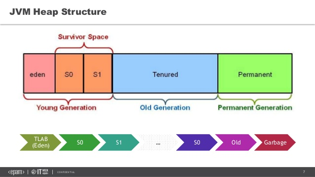
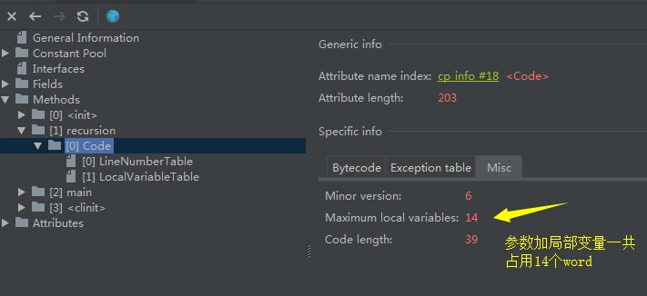

# 实战JAVA虚拟机

# java语言规范

语法，词法，支持的数据类型，变量类型，数据类型转换的约定，数组，异常等，告诉开发人员“java代码应该怎么样写”

## 词法

什么样的单词是对的。

|整数可以有下划线

## 语法

什么样的语句是对的。

## 数据类型的定义

char为16位无符号整数。
float和double为满足IEEE754的32位浮点数和64位浮点数。

引用数据类型分为3重
* 类/接口
* 泛型类型
* 数组类型

## 数字编码

整数用补码表示，正数的补码是本身，负数的补码就是反码+1。反码就是符号位不变，其他位取反。

### 补码的好处
* 0既不是正数也不是负数，反码不好表示，补码则相同。
* 补码将加减法的做法完全统一，无需区分正数和负数

### 浮点数的表示

IEEE754规范，一个浮点数由符号位，指数位和尾数位3部分组成。
32位的float类型，符号位1位，指数位8位，尾数位为23位。

| s eeeeeeee m(23个）
| 当e全部为0的时候，m前面加0，否则加1


浮点数取值为 s * m * 2的（e-127）次方

-5 = 1 1000001 010（21个0）

因为 e 不全为0，前面加个1，实际尾数为 1010（21个0）

```
-5 = -1 * 2的（129-127）次方 * （1*2的0次方+0*2的-1次方+1*2的-2次方+0*2的-3次方+后面都是0）
    = -1 * 4 * （1 + 0 + 1/4 + 0 ...）
    = -1 * 4 * 1.25
    = -5
```

```java
        float f = -5;

        // float的内部表示
        System.out.println(Integer.toBinaryString(Float.floatToRawIntBits(f)));
//1  10000001(指数位8位)  01000000000000000000000（23位）
	

        double d = -5;

//1 10000000001（指数位11位） 0100000000000000000000000000000000000000000000000000（52位）
        // double 的内部表示
        System.out.println(Long.toBinaryString(Double.doubleToRawLongBits(d)));
```

# 基本结构


NIO可以使用直接内存（堆外内存）。

PC：如果是不是本地方法，PC指向正在执行的指令，如果是本地方法，PC就是undefined。

## 堆



## 栈

| -Xss128K 指定最大栈空间。

线程私有的内存空间。

至少包含：
* 局部变量表
* 操作数栈
* 帧数据区

函数被返回的时候，栈帧被弹出。二种方式
* 正常返回，就是return
* 异常抛出

栈深度太大，会抛出 **StackOverflowError** 栈溢出错误。


### 局部变量表

保持函数的参数和局部变量。越多越大，嵌套调用次数就会减少。

```java
    public static  void recursion(int i1, float f1, long l1, double d1){
        count++;

        // 局部变量
        int i2=1; // 1 word = 32bit
        float f2 = 2f; // 1 word
        long l2 = 3L; // 2 word
        double d2 = 4; // 2 word

        Object o1= null; // 1 word
        Object o2= null; // 1 word

        recursion(i1,f1,l1, d1);
    }
```




**槽位复用**

```java
    // 复用槽位
    public static  void recursion2(int i1){
        {
            int i2 = i1;
            System.out.println(i2); // 需要使用，否则优化掉了
        }

        int i3 = 1;
    }
```


**占2word的槽位的复用**

```java
    // 局部变量表是4 word
    public static  void recursion3(double d1){
        {
            double d2 = d1; // 2 word
            System.out.println(d2);
        }

        int i3 = 1; // 1 word 复用 d2的第一个1槽位
        int i4 = 2; // 1 word 复用 d2的第二个操作
    }

```

**槽位和gc**

```java
    public static  void gc(){
        {
            byte[] a = new byte[6*1024*1024];
        }

        // a 虽然失效，但仍然在局部变量表，无法gc
        System.gc();
    }

    public static  void gc2(){
        {
            byte[] a = new byte[6*1024*1024];
        }

        int c = 1;

        // a 虽然失效，但仍然在局部变量表，无法gc
        System.gc();
    }
```


